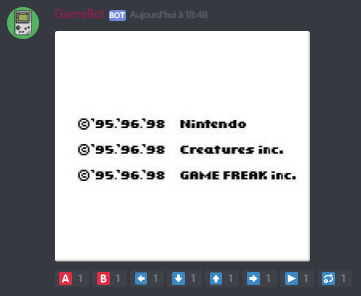

# GameBot
A Proof-Of-Concept Discord Bot that lets people play gameboy games.

This code is only tested on Linux. Works on both ARM (Raspberry Pi) and x86/64.

You will need to install:
- Gambatte SDL (and set it up in PATH) (https://sourceforge.net/projects/gambatte/files/gambatte/r571/)
- `sudo apt-get install pyscreenshot wmctrl`
- `sudo pip install pynput discord.py asyncio`

